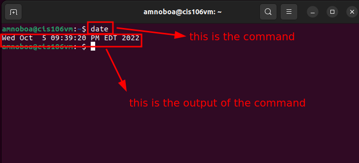
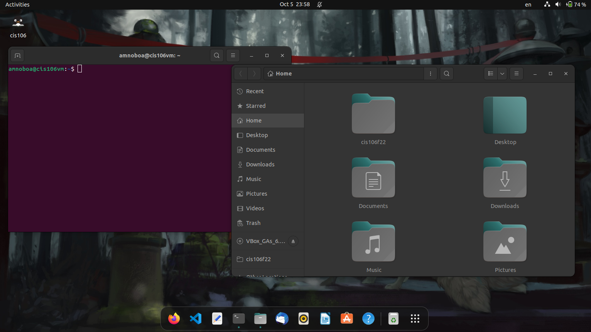

# Lab 3 Submission

## Question 1
Has no submission

## Question 2

## Question 3

| Program purpose     | Package Name     | Version                                  |
| ------------------- | ---------------- | ---------------------------------------- |
| Play a tetris game  | blockattack      | 2.7.0-1 amd64                            |
| Play a video file   | dragonplayer     | 4:21.12.3-0ubuntu1 amd64                 |
| Browse the internet | epiphany-browser | 42.4-0ubuntu1 amd64                      |
| Read your email     | plasma-gmailfeed | 1.1-2 amd64                              |
| Play music          | clementine       | 1.4.0~rc1+git347-gfc4cb6fc7+dfsg-2 amd64 |

1. Which command did you use to install?
   ***sudo apt install package -y***

2. Which command did you use to remove?
   ***sudo apt remove package -y***
   
3. Which command will you use to install, and remove?
   ***sudo apt install package+ package-***

## Question 4

| command | what it does                       |
| ------- | ---------------------------------- |
| echo    | display a line of text             |
| fortune | No manual entry                    |
| cowsay  | No manual entry                    |
| lolcat  | No manual entry                    |
| figlet  | No manual entry                    |
| toilet  | display large colourful characters |
| rig     | No manual entry                    |