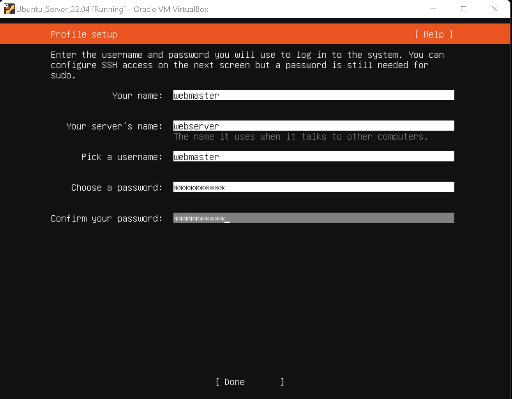
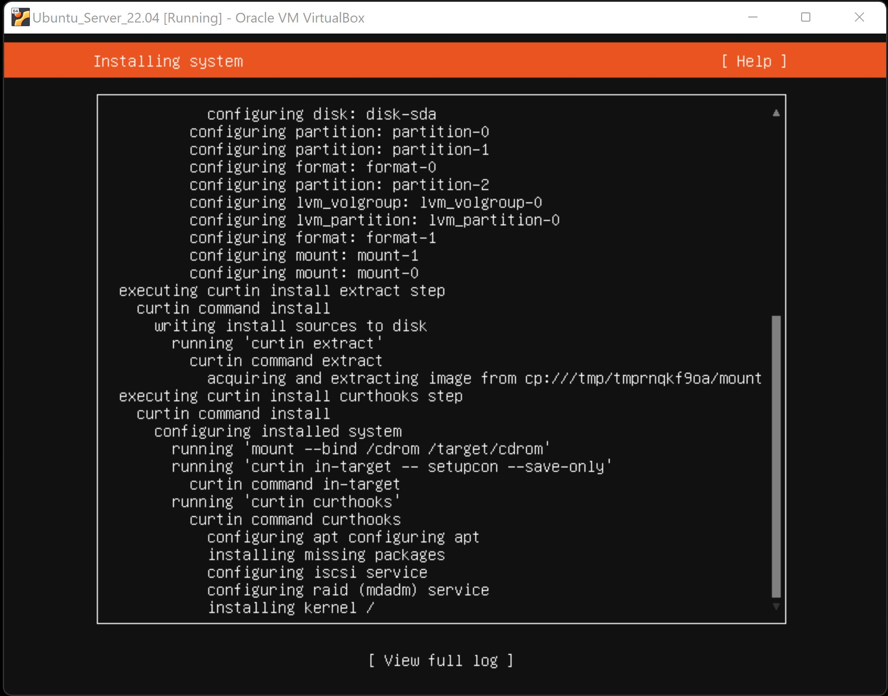
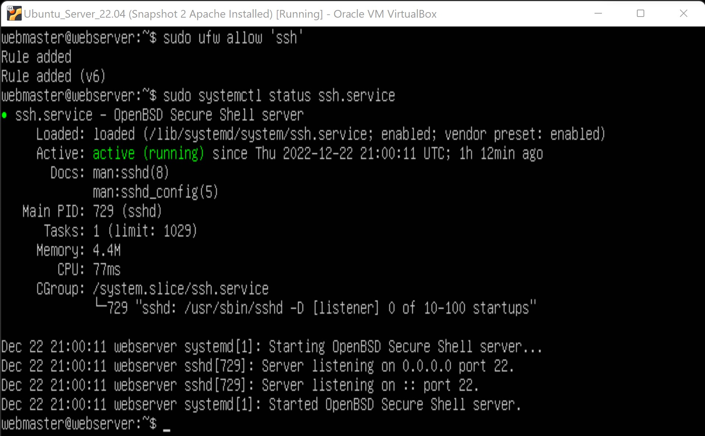
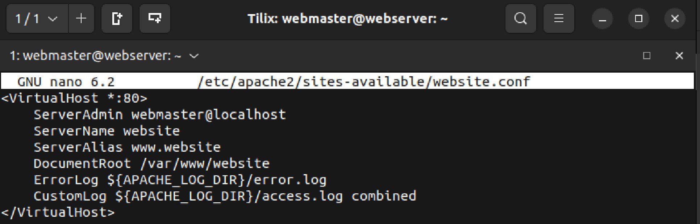

# Sever Installed

## Recommended Requirement System 
**In order to create a server there will be a few step the user will need to take.The most important step would be to make user there is a good amount of system storage where the server can be save. Most commonly use Ubuntu can be use as a web-server and for the virtual machine the use of virtualbox will be helping set up the server, remember that once ubuntu is download and set with the virtual box then the user can create a user name, server name, pick name and create a password. There will be SSH set up which will be install but there will not be any import identity and last there will have to be a waiting time until server is install**
 
 
 
 
 
 
 
 

# Apache Installed
**In order to install Apache 2 make sure to use Sudo and once is install then we will try allowing Apache to run. Enabling  the firewall will start the system and make the status of the firewall active. The user can then re-check the status and see it will show this time as active but if that is not enough then the user can input the ip address of the server in a website and in return it will show Ubuntu website running as default**
 
 
 
 
 
 
 

# SSH Set Up
**Before setting up the SSH for our website the user should have an understanding of the ip address, subnet, ip route for the server. After knowing that the user have to create a nano name 01-netcfg.yam inside the directory of /etc/net-plan/. Once this step is done then the user can ping to google to see if there is any connection which should show 0% packet, plus remember to allow ssh and finally using sudo we will find the status of the ssh service. Once all this step is done then the user can install openssh-server.**
 
 
 
 
 
 
 
 
 
 

**remember always to keep in a save file the ip address and ip route of the server**

**Creating a configuration file**

# Enable Virtual Hosts
**Before you enabling a virtual hosts remember to turn on your server. Once the server is fully running the user can create a file inside the directory website and in this file nano will be use to run the program , don't forget also to nano the website.conf, the following step will guide the user to create a main website called index.html**
 
 
 
 
 
 
 
 

# Add a sample site
**Having a website could be difficult if the user is not so much of a web developer, thankfully there are website which can help the user create a website or a sample website. Most of the bootstap website will be file that needs to be downloaded. Once the file are download in the correct home then the user can unzip the file *(remember to have unzip install)*, after unzip the directories then the user can change his directory to the unzip website and finally copy all files from the website to the owner domain been created in /var/www/domain**

In the pictures below there will be some steps which could help set up the sample website
 
 
 
 
