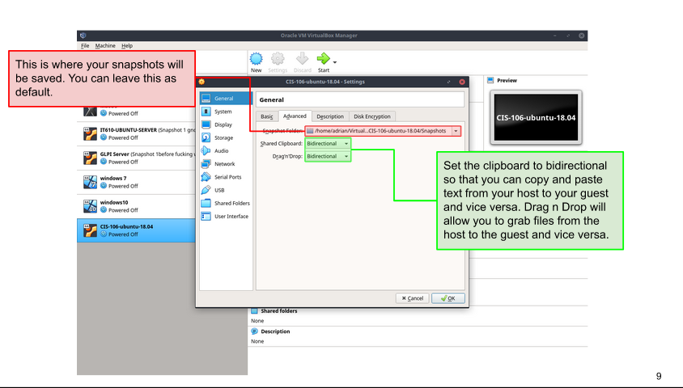
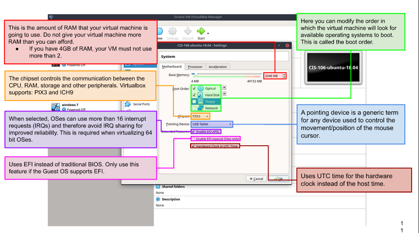
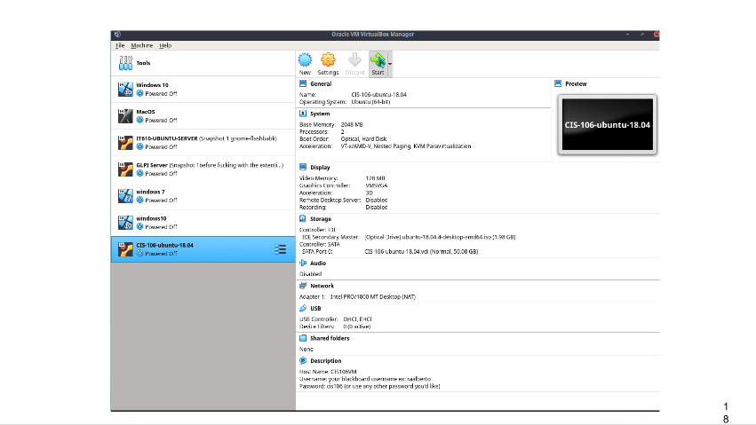
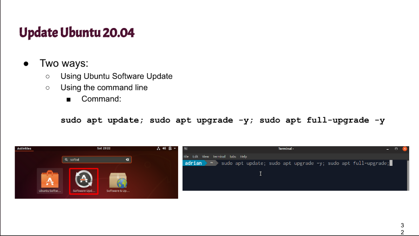
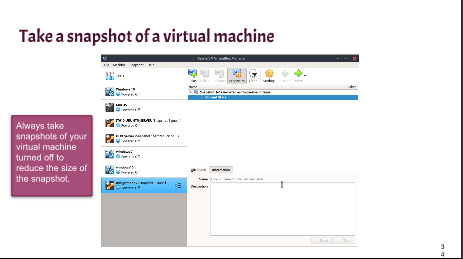

# Week Report 2

## The basic of Virtualization

1. **What is virtualization**
Definition: A simulation of a physical machine that could be use virtually.

2. **Types of virtualization**
* **Server Side Virtualization**
Definition: One physical machine that can create multiple servers in each single device. Also can be use either on a ***thing-client*** or a ***thick-client*** 
 

* **Client-side Virtualization**
Definition: A software application that can be installed in a computer and it has an operating system for each vm. Also, requires a ***hypervisor*** and a ***hardware support***.

## Installing Ubuntu in Virtualbox
* Bidirectional

* Motherboard 

* Starting Ubuntu

* Two different ways to Update Ubuntu

* Taking a snapshot

