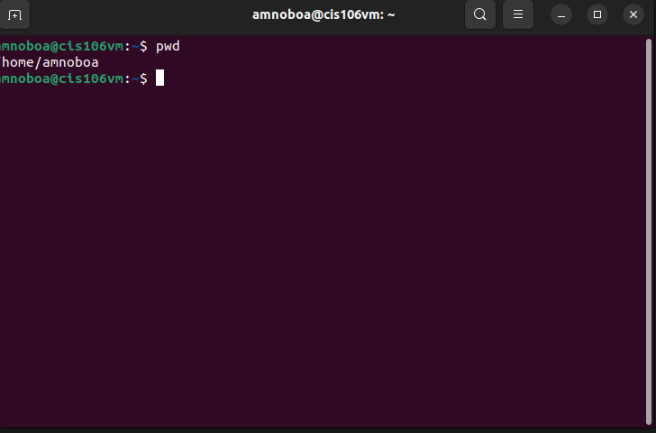
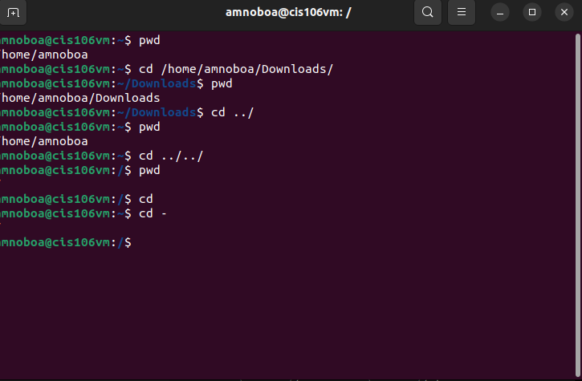
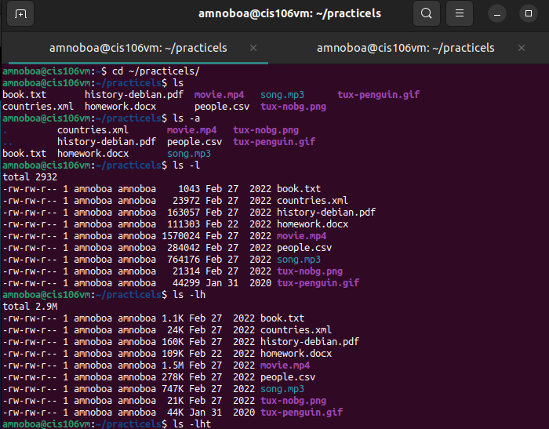
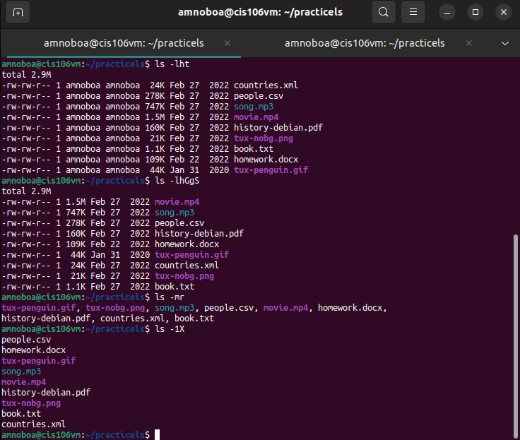

# Week Report 4

## Practice

## The Filesystem (Some Important Directories)

| Directory | Data Stored in Directory                                                                                                                       |
| --------- | ---------------------------------------------------------------------------------------------------------------------------------------------- |
| bin       | Essential Commands.                                                                                                                            |
| dev       | Device files.                                                                                                                                  |
| etc       | System configuration files.                                                                                                                    |
| home      | User home directories.                                                                                                                         |
| media     | Mount point for removable media, such as DVDs and floppy disks.                                                                                |
| opt       | Add-on software packages.                                                                                                                      |
| proc      | Kernel information, process control, system hardware information.                                                                              |
| srv       | information relating to services that run on the system.                                                                                       |
| usr       | Software not essential for system operation, such as applications.                                                                             |
| var       | Dedicated to variable data, such as logs, databases, websites, and temporary spool (e-mail etc.) files that persist from one boot to the next. |

## Commands to navigate the filesystem

| Command | What it does                                          | Syntax   | Example         |
| ------- | ----------------------------------------------------- | -------- | --------------- |
| pwd     | print current working directory                       | `pwd`    | `pwd`           |
| cd      | change the current directory                          | `cd`     | `cd Downloads/` |
| cd -    | goes back to the previous command                     | `cd -`   | `cd -`          |
| ls      | list all the files on a directory                     | `ls`     | `ls`            |
| ls -l   | long list the directory                               | `ls -l`  | `ls -l`         |
| ls -lh  | long list the directory with human readable file      | `ls -lh` | `ls -lh`        |
| ls -R   | list all the files in the given directory recursively | `ls -R`  | `ls -R`         |

## Key terms

* **File system:** An structure in which the files are stored and organized for the simplicity of accessing the data.
* **Current directory:** the directory in which the user is located at the moment.
* **parent directory:** A subdirectory can be located inside the directory. 
* the difference between *"your home directory"* and *"the home directory"*
  * **Your home directory:** Refers to the home directory the user is able to modify
  * **The home directory:** Refers to the home directory located in the root
* **pathname:** Indicate the location of the file in the filesystem
* **relative path:** Starts with root **(/)**
* **absolute path:** Starts with the subdirectory
* The commands are used for navigating the filesystem.
    * pwd
    * cd
    * ls
