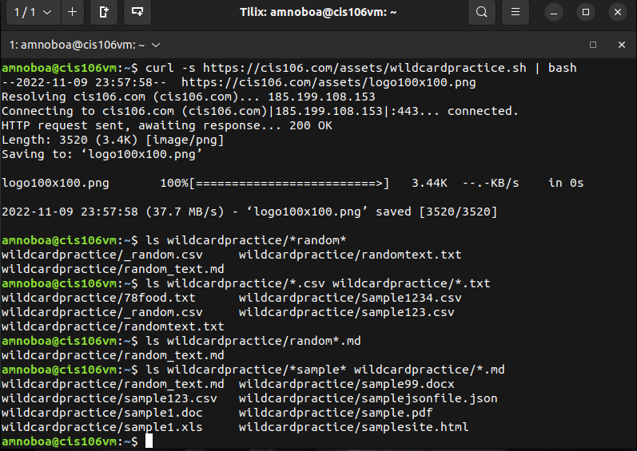
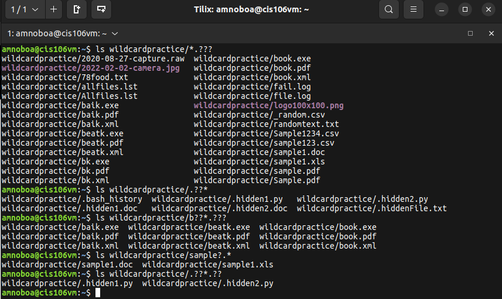
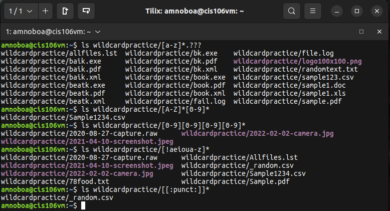

# Week Report 6

## Wildcards
Wildcard represents letters and characters used to specify a file name for searches.

### * Wildcard
The * wildcard matches from 0 to any number of characters.
* Examples:
  * List all the files that end in .txt
    * `ls *.txt`
  * list all the files start with the string "file." regardless of their file extension
    * `ls file.*`
  * list all the file that have any letter before the string "file." and after as well
    * `ls *file.*`

### ? Wildcard
The ? wilcard matches a single character.
* Examples:
  * List all the files that have a single character between letter f and l
    * `ls f?l*`
  * list all the files that have a two character between letter b and k.
    * `ls b??k*`
  * list all the files that have a 3 letter file extension.
    * `ls *.???`

### [] Wildcard
The [] wildcard matches a single character in a range
The [] wilcard use an ! mark to reverse the match
* Examples:
  * List all files that have a vowel after letter f
    * `ls f[aeiou]`
  * List all the files who name does not have a number in their file name
    * `ls *[!0-9].*`
  * List all files whose name begins with any 3 combination of numbers and the current user's username
    * `ls [0-9][0-9][0-9]$USER`

## Practices 

### Practice 5

### Practice 6

### Practice 7

## {} Brace Expansion
The {} is not a wildcard but another feature of bash that allows you to generate arbitrary string to use with commands

* Examples:
  * To create a whole directory structure in a single command
    * `mkdir -p music/{jazz,rock}/{mp3files,videos,oggfiles}/new{1..3}`
  * To create a N number of files use
    * `touch website{1..5}.html`
    * `touch file {{a..z},{0..10}}.js`
  * Remove multiple files in a single directory
    * `rm -r {dir1,dir2,dir3,file.txt,file.py}`